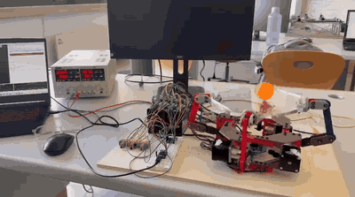
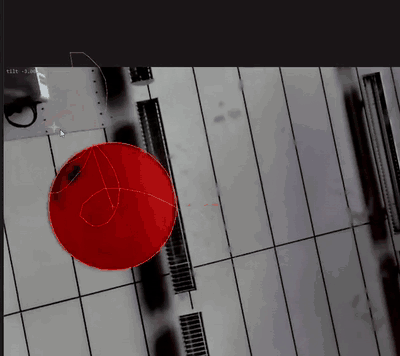
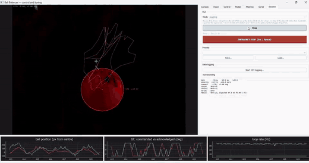

# Dynamic Platform — a camera-guided ball balancing and juggling robot

A four-arm parallel platform that balances and juggles a 40 mm ball. A camera **underneath a
transparent plate** tracks the ball, a PC works out the plate tilt and height that bring it back to
the target, and a Teensy 4.0 turns that pose into step pulses for four geared stepper motors.

Built for a thesis at Deggendorf Institute of Technology, Campus Cham, on top of Tobias Kuhn's
open-source [HighPrecisionStepperJuggler](https://github.com/T-Kuhn/HighPrecisionStepperJuggler).

## Demo



**Juggling.** The plate throws the ball and catches it, over and over.



**Holding a target.** What the camera under the plate sees. The ball is outlined in red and the
**green cross is the commanded position** — the loop keeps the ball on it. Clicking the video in the
app moves the target.



**Juggling from the camera view.** The same juggle inside the control app, with the live plots
running: ball position, commanded versus acknowledged tilt, and loop rate.

## Run the demo

You need the machine powered up, the camera plugged in, and the
[firmware](docs/firmware.md) already on the Teensy. Note the Teensy's COM port first.

### The quick way — PyQt5 app

```bash
cd pyballbalancer
pip install -r requirements.txt
python main.py
```

Then, in the window:

1. **Serial** tab → *Refresh ports* → pick the `COMx` → *Connect*
2. **Machine** tab → *Go to ORIGIN* — the plate should rise and sit level
3. Place the ball on the plate
4. **Session** tab → choose **Balancing** → *Start control*

Try **Juggling** on the Session tab once balancing holds. Click the video to move the target.

- **Stop:** `Esc` or `Space`, or the red button.
- **Close the window normally** rather than killing the process — closing parks the plate level. If
  the plate is left leaning, run `python park.py`.

### The other way — Unity app

Open the project in **Unity 2019.2.23f1**, load
`Assets/HighPrecisionStepperJuggler/MainScene.unity`, set the serial port and strategy program in
the Inspector, press **Play**, then **Space** to arm. Full steps: [docs/unity-app.md](docs/unity-app.md).

## Two hosts, one machine

There are **two separate programs** that can drive this machine, and they share only the hardware
and the firmware:

| | [PyQt5 app](pyballbalancer/README.md) | [Unity app](docs/unity-app.md) |
|---|---|---|
| Language | Python 3 | C# (Unity 2019.2.23f1) + a C++ OpenCV plugin |
| Camera frame | 640 × 480 landscape | 480 × 640 portrait |
| Gain units | degrees per **pixel** | degrees per **millimetre** |
| Tuning | live, from GUI tabs | Inspector values in the scene |

**Do not copy tuning from one to the other.** Different frame orientations, different units,
different calibration — the same number means something else in each. Only one of them can hold the
serial port, so close one before starting the other.

## Documentation

| Page | What is in it |
|---|---|
| [docs/hardware.md](docs/hardware.md) | Parts, wiring, DM542T switch settings, power |
| [docs/firmware.md](docs/firmware.md) | Uploading to the Teensy, the wire protocol, key constants |
| [pyballbalancer/README.md](pyballbalancer/README.md) | The PyQt5 app in full: modes, calibration, tuning, every script |
| [docs/unity-app.md](docs/unity-app.md) | Unity setup, strategy programs, keyboard controls, calibration |
| [docs/camera-and-motion.md](docs/camera-and-motion.md) | Why the camera's field of view limits the design, and the throw physics |
| [docs/troubleshooting.md](docs/troubleshooting.md) | Known issues, traps, and what to check when nothing moves |
| [docs/repository.md](docs/repository.md) | Folder layout, Git LFS notes, thesis tooling |

## Licence and credits

Firmware, Unity application, camera plugin and the original paper are by **Tobias Kuhn** — see
[HighPrecisionStepperJuggler](https://github.com/T-Kuhn/HighPrecisionStepperJuggler) and the related
[Octo-Bouncer](https://www.electrondust.com/2020/03/01/the-octo-bouncer/), MIT licence
([LICENSE](HighPrecisionStepperJuggler-master/LICENSE)).

The hardware rebuild, firmware fixes, Unity extensions, the PyQt5 application and all calibration in
this repository are by **Anandhu Vijayan**.
