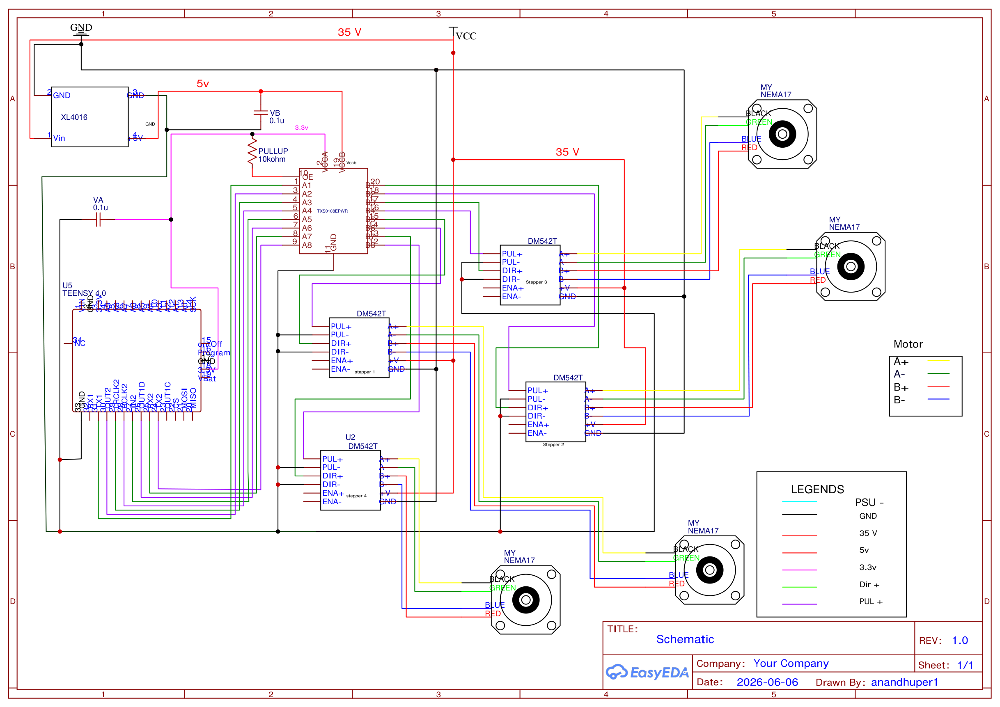

# Hardware setup

### Parts

| Part | Detail |
|---|---|
| Microcontroller | Teensy 4.0 |
| Stepper drivers | 4 × StepperOnline **DM542T** |
| Motors | 4 × NEMA17 **17HS19-1684S-PG5** — 1.8°/step, **5.18:1** planetary gearbox, 1.68 A/phase |
| Power | 35 V / 8 A supply; **XL4016** buck converter for the 5 V rail |
| Linkage | 4 arms, `L1 = 89 mm`, `L2 = 80 mm`, plate joints 299 mm apart, `Q = 70.023 mm` |
| Camera | UVC USB camera, 60.41° horizontal FOV, mounted **below** a transparent plate |
| Ball | 40 mm diameter (radius 20 mm) |

Datasheets for all of these are in [`datasheets/`](../datasheets/); CAD is in [`Design/`](../Design/)
and [`stl files/`](../stl%20files/).

### Wiring (Teensy → DM542T)

The finalised, working connection diagram:

*Click for the vector PDF ([media/wiring-schematic.pdf](media/wiring-schematic.pdf)). Drawn in
EasyEDA; the source is also kept in
[`my_documents/connection diagrams/`](../my_documents/connection%20diagrams/).*

Reading it: the main rail feeds all four `DM542T` `+V` inputs and an **XL4016** buck converter that
makes **5 V**; the **TXS0108E** shifts the Teensy's eight STEP/DIR lines up to that 5 V rail
(`VCCA` 3.3 V, `VCCB` 5 V, `OE` held high through a 10 kΩ pull-up, 0.1 µF on each supply). Motor
coils follow the legend — **A+ yellow, A− green, B+ red, B− blue**.

Pin numbers are fixed in the firmware's `Constants.h`:

| Motor | STEP pin | DIR pin |
|---|---|---|
| 1 | 6 | 5 |
| 2 | 2 | 1 |
| 3 | 4 | 3 |
| 4 | 8 | 7 |

Common-cathode wiring: `PUL-` and `DIR-` to GND, the `+` inputs driven from the Teensy through the
level shifter, `ENA` left unconnected (enabled).

> **Signal levels.** The Teensy is a 3.3 V part and the DM542T inputs are optocouplers specified for
> 5 V, which is why the TXS0108E sits between them in the schematic above. Note that the TXS0108E is
> an auto-direction transceiver with weak drive: earlier bring-up on this rig found it could not
> source what the opto inputs wanted, and the lines were temporarily driven straight from the
> Teensy at 3.3 V instead. If the drivers ever behave as though they are missing pulses at speed, a
> stronger 5 V buffer — a 74HCT541, or one NPN transistor per line — is the robust fix.

### DM542T DIP switches

| Setting | Switches | Value |
|---|---|---|
| Microstepping | SW5 ON, SW6 ON, SW7 OFF, SW8 ON | **1/16 → 3200 pulses per motor rev** |
| Current | SW1 ON, SW2 OFF, SW3 ON | 1.36 A RMS / 1.91 A peak |
| Standstill | SW4 OFF | current halved at rest |

**The microstep setting and the firmware must agree.** `PULSES_PER_REV` in `Constants.h` is
`200 × microsteps × 5.18` = `200 × 16 × 5.18` = **16576**. If you change the DIP switches, change
that constant and re-upload, or every move produces the wrong pulse count and the motors stall.
Never change DIP switches or unplug a motor with the driver powered.

The firmware that drives this hardware is documented in [firmware.md](firmware.md).

---

[← Back to the main README](../README.md) · [Hardware](hardware.md) · [Firmware](firmware.md) · [PyQt app](../pyballbalancer/README.md) · [Unity app](unity-app.md) · [Camera & motion](camera-and-motion.md) · [Troubleshooting](troubleshooting.md) · [Repository](repository.md)
